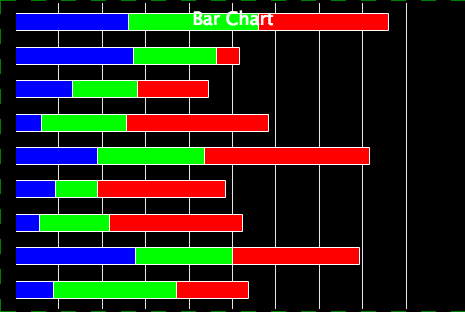
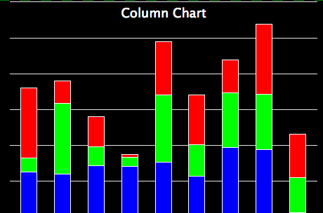

# Bar/Column Chart

## Description

This is used to create a simple Bar Chart, Or a Column Chart

## Screenshots





## Additional Information/Notes
> None
---
## Installation
Download and install update set **[pe-bar-chart.u-update-set.xml](https://github.com/platform-experience/serviceportal-widget-library/blob/master/highcharts/pe-bar-chart/pe-bar-chart.u-update-set.xml)** <br/><br/>
After installation, the widget can be accessed via the `Service Portal > Widgets` section for use and customization.<br/>
* SN Product Documentation - ['Load a customization from a single XML file'](https://docs.servicenow.com/bundle/jakarta-application-development/page/build/system-update-sets/task/t_SaveAnUpdateSetAsAnXMLFile.html)

---
## Configuration
Widget Option Schema parameters:

**"Type"** Toggle chart between Bar chart and Column chart. `Default: Bar chart`<br/>
**"Update Interval"** Chart refresh interval.<br/>
**"Table"** Table from which to aggregate the data. `Overrides the Script Include parameter`<br/>
**"Fields"** Table fields used for the aggregation of data.<br/>
**"Encoded Query"** The encoded query limit the data returned.  `All data returned if empty.`<br/>
**"Script Include"** Used to get specific calculated data or more advanced data sets. By default this value is `"PEHighchartsExample"` for demo purposes. `Overridden if the 'Table' parameter is used.`<br/>
**"Function"** Function defined in the Script Include. `Default: "getDemoData"` for demo purposes<br/>
**"Parameter1"** A parameter passed/sent to the Script Include and Function combination.<br/>
**"Advance"** A JSON block; used to set specific attributes of the chart. All attributes that are editable can be found here [Highcharts Documentation](http://api.highcharts.com/highcharts). <br/>

Example:
```json
{
    "title":{
        "text":"Bar Chart",
        "style":{
            "color":"white"
        }
    },
    "options":{
        "colors": ["rgba(255, 0, 0,1)", "rgba(0, 255, 0,1)", "rgba(0, 0, 255,1)"],
        "exporting":{
            "enabled":false
        },
        "chart":{
            "backgroundColor":null,
            "margin": [2, 0, 2, 0],
            "borderWidth":0,
            "height":310
        },
		"legend":{
			"enabled":false
		},
        "plotOptions":{
            "series":{
                "stacking":"normal"
            }
        }
    }
}
```


---
## Platform Dependencies
> None
---
## Sample Data and Data Structures
> None
---
## API Dependencies
<i>Dependencies are included and configured as part of the provided Update Set.</i>

* HighCharts API (v 5.0.5 - Recommended)  w/Export and No Data plug-ins
  <br/>Latest version(s) available from [HighCharts.com](http://http://www.highcharts.com/products/highcharts/)
  <br/>Additional HighCharts Utility - [highcharts-ng](https://github.com/pablojim/highcharts-ng) - Angular Directive for HighCharts (__not used or distributed__)

---
## CSS/SASS Variables
_CSS/SASS variables are given default values that can be overridden with theming or portal-level CSS._
> None
