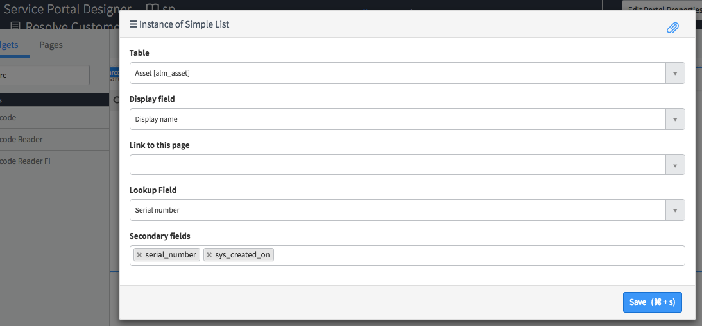
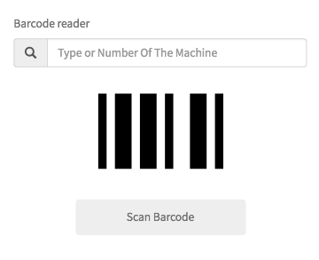
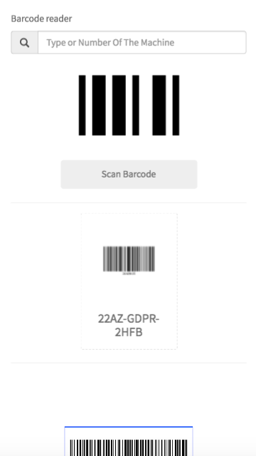
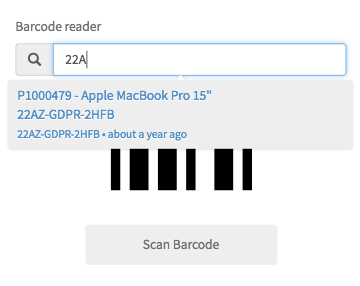

## Barcode Reader FI

## Description

This widget can be used to read a bar code in different formats or to manually enter it, providing a backend lookup just specifying table name and lookup column in the options.
The image can be provided straigh from camera or camera roll/file system (mobile and desktop).

## Screenshots
  
  
  
 
With manual lookup
  

## Additional Information/Notes
> None
---
## Installation
Download and install update set **[pe-barcode-reader-fi.u-update-set.xml](pe-barcode-reader-fi.u-update-set.xml)**   
After installation, the widget can be accessed via the `Service Portal > Widgets` section for use and customization. 
* SN Product Documentation - ['Load a customization from a single XML file'](https://docs.servicenow.com/search?q=Load+a+customization+from+a+single+XML+file)   (<i>Select appropriate instance version</i>)
---
## Configuration
Language variants can be created through the section System UI -> UI Messages, and displayed adding in the HTML body a statement with the syntax: 
* ${<i>key value specified in the Message record</i>}.

Widget Option Schema parameters:

**"Table"**  the table containing the products/items to search for 
**"Display field"**  the column name with the value to display on UI 
**"Lookup field"**  the column name containing the barcode 
**"Additional fields"**  additional columns to display on UI 

---
## Platform Dependencies
> None
---
## Sample Data and Data Structures
> See 'Configuration' above
---
## API Dependencies
* QuaggaJS  
<i>Dependencies are included and configured as part of the provided Update Set.</i>
---
## CSS/SASS Variables
The widget is using colors from Bootstrap SASS variables, and a minimal style configuration to make it easy to customize.
_CSS/SASS variables are given default values that can be overridden with theming or portal-level CSS._
