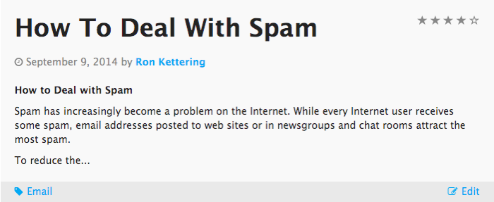
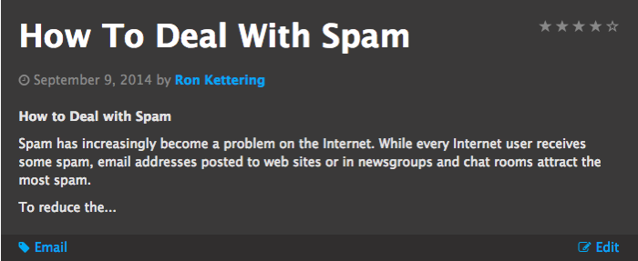

# Blog

## Description

This widget can be utilized to create a blog from KB articles with configurable options.

## Screenshots

## Additional Information/Notes
> None

---
## Installation

Download and install update set **[pe-blog.u-update-set.xml](https://github.com/platform-experience/serviceportal-widget-library/blob/master/pe-blog/pe-blog.u-update-set.xml)**   
After installation, the widget can be accessed via the `Service Portal > Widgets` section for use and customization. 
* SN Product Documentation - ['Load a customization from a single XML file'](https://docs.servicenow.com/bundle/istanbul-application-development/page/build/system-update-sets/task/t_LoadCustomizationsFromAnXMLFile.html)

---

## Configuration

Widget Option Schema parameters:

**"KB category"** Used to set the blog category. `Default: Email` 
**"Max entries"** This is for setting the maximum number of blog entries. `Default: 5` 
**"Excerpt character limit"** This is for defining the blog excerpt character limit. `Default: 300` 
**"Theme"** This is for setting the blog theme. There are three options: Dark, Dracula and Light. `Default: Light` 
**"Edit role"** This option is for selecting the role that will be able to view the edit button. `Default: admin` 
**"Display excerpt"** Used to show or hide the excerpt. `Default: checked` 
**"Display ratings"** Used to show or hide the ratings. `Default: checked` 

---

## Platform Dependencies

### SN System Tables
* kb_knowledge

---

## Sample Data and Data Structures

> See 'Configuration' above

---

## API Dependencies

<i>Dependencies are included and configured as part of the provided Update Set.</i>
> None

---

## CSS/SASS Variables

_CSS/SASS variables are given default values that can be overridden with theming or portal-level CSS._

`$pe-light-theme-header: #222 !default;` 
`$pe-dark-theme-header: #fff !default;` 
`$pe-dracula-theme-header: #bd93f9 !default;` 
`$pe-sub-header-color: #777 !default;` 
`$pe-anchor-color: #03a9f4 !default;` 
`$pe-font-size: 1.5rem !default;` 