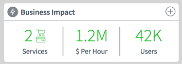

## Synopsis: Business Impact Widgets




This widget displays information related to business services related to an anomaly alert.

## Installation

Installation is very simple, you can just download the update set "pe-business-impact.u-update-set.xml" and install it on your instance. Then the widget is available for you to drag and drop on your page.

## Configuration

Use the following options to configure the widget:

1. **alert**: Provide an anomaly alert's sys_id and data in the widget will display based on related records.

1. **titleIconClasses**: Provide a set of Font Awesome css classes for an icon to display next to the title. Defaults to `'fa fa-bolt'`.

## Displayed Data

The provided anomaly alert sys_id determines what is displayed in the widget. The services shown and number of users are counted from the business service associated with the alert and any dependent business services, and their user groups.

Revenue information is currently faked, and would need to be coordinated with an appropriate record attribute to be accurate.

## Bundled Widget

This widget makes use of the `pe-business-impact-details` widget, for the content of the expanded drawer. This additional widget is included in the update set.

The details widget can also be used on its own, given an alert's sys_id.

## Sass Variables

The following Sass variables are given default values that can be overridden with theming or portal-level css.

```scss
$icon-circle-color: #7e848b !default;
$text-color: #485563 !default;
$divider-color: #7E848B !default;
$status-alert-color: #ff6f00 !default;
$status-recovered-color: #34ba3d !default;
```

And for the drawer details:

```scss
$list-header-bg-color: #e8e8e8 !default;
$state-default-color: #557f90 !default;
$state-positive: #3abe43 !default;
$state-negative: #ff402c !default;
```