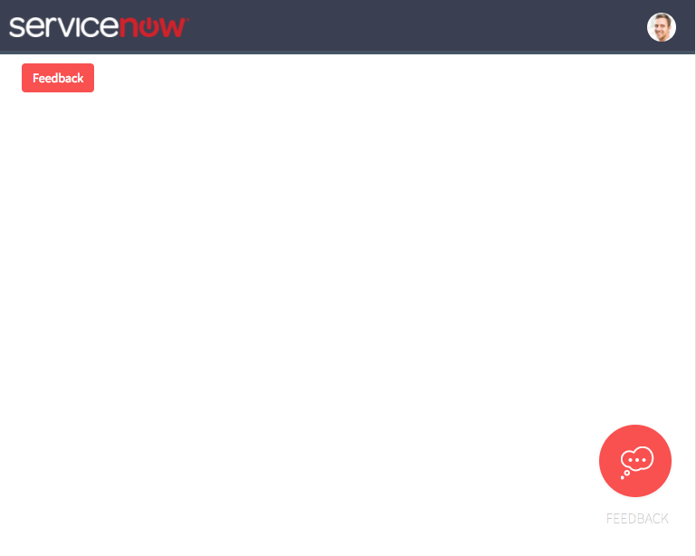
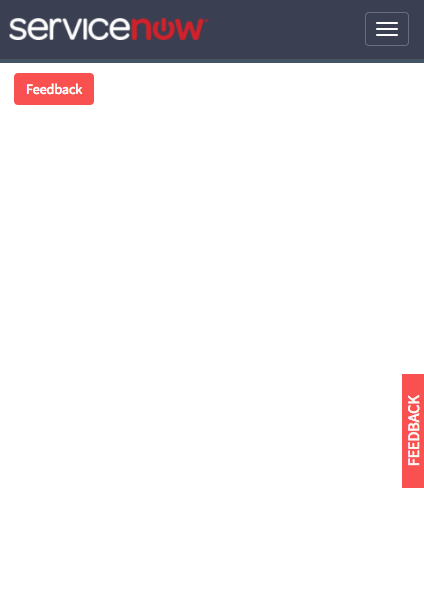
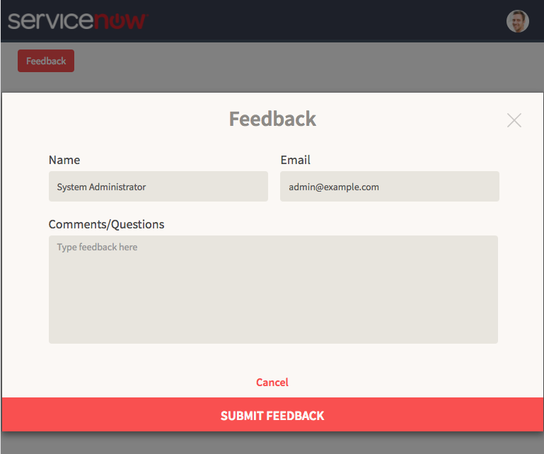
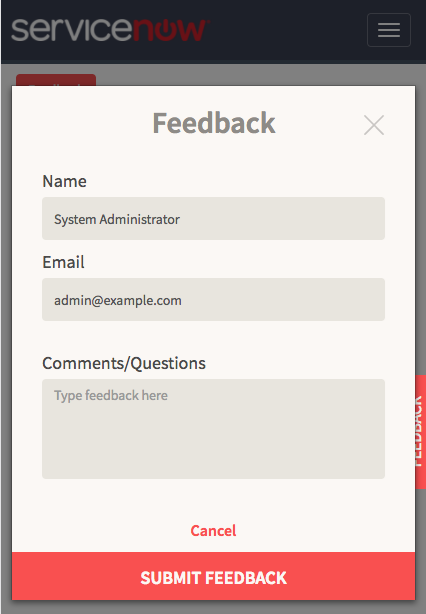

## Simple Feedback - Styled

## Description

Widget provides a simple feedback collection capability that can be added to a site.  
The feedback input shows as a modal dialog and can be configurable in how it functions.
> This widget does not contain a Ratings collection capability. Use the 'Simple Feedback' widget for an example that incorporates Ratings collection.

## Screenshots
### Button Style Choices
>Desktop


>Mobile


### Modal
>Desktop


>Mobile



## Additional Information/Notes 
Update set installs the data table 'Simple Feedback' (u_simple_feedback)

## Implementation Notes
Alternative to [adding the widget](https://docs.servicenow.com/search?q=Add+Widgets+To+A+Page) as an instance to a Service Portal Page, the widget can be injected within another widget's HTML and activated via a javascript function:
> HTML Body
```HTML
<div class="simple-feedback-styled">
    <sp-widget widget="c.feedbackWidget"></sp-widget>
</div>
```
>Client Controller
```Javascript
function activateFeedbackWidget() {
    spUtil.get('simple-feedback-styled').then(function(response) {
        c.feedbackWidget = response;
    });
}
```

#### Broadcast New Styling

Additionally, the following RootScope Broadcast statement can be used to change the CSS of the buttons without modifying the widget's SASS/CSS

```Javascript
$rootScope.$broadcast('fbStyleButton', {
    div:{
        //Outer container <DIV> holding the button and/or label
    },
    button : {
        //CSS attribute and value must be strings
        "background-color": "#09639b",
        "box-shadow":"0 1px 4px 2px rgba(0, 0, 0, 0.2)"
    },
    label : {
        //CSS attribute and value must be strings
        "display" : "none",
        "color" : "#ffffff"
    }
});
```

---
## Installation
Download and install update set **[pe-simplefeedback-styled.u-update-set.xml](pe-simplefeedback-styled.u-update-set.xml)** <br/><br/>
After installation, the widget can be accessed via the `Service Portal > Widgets` section for use and customization.<br/>
* SN Product Documentation - ['Load a customization from a single XML file'](https://docs.servicenow.com/search?q=Load+a+customization+from+a+single+XML+file)   (<i>Select appropriate instance version</i>)

---
## Configuration
Widget Option Schema parameters:

**dataTable** - Data Table Name `Default: u_simple_feedback`<br/>
**autoHideTY** - Auto Hide Feedback Thank You `Default: true`<br/>
**autoHideDuration** - Auto Hide Duration (in seconds) `Default: 2.0`<br/>
**showFormButton** - Show Form Button `Default: true` - set to false if providing different button or opening method<br/>
**hdrTitle** - Header Title `Default: Feedback`<br/>
**hdrIcon** - Header Icon `Default: ""`<br/> 
**txtTYMsg** - Thank You Message `Default: Thank you for your feedback.`<br/>
**showWho** - Show Who `Default: true`<br/>

> Note: **hdrIcon** - Can be replaced with any supported glyph/icon using the [fontawesome.io](http://fontawesome.io/cheatsheet/) classes.

---
## Platform Dependencies
> None

---
## Sample Data and Data Structures

`Table is created with update set - u_simple_feedback`

---
## API Dependencies
<i>Dependencies are included and configured as part of the provided Update Set.</i>
> None

---
## CSS/SASS Variables
_CSS/SASS variables are given default values that can be overridden with theming or portal-level CSS._

```CSS
$fb-cream: #fbf8f5 !default;
$fb-coral: #f95050 !default;
$fb-darktan: #8e8b87 !default;
$fb-tan: #e8e5de !default;
$fb-label: #4a4a4a !default;
$fb-white: #ffffff !default;

/* Change to desired Color */
$fb-btn-background: $fb-coral !default;
/* Or comment out the above and uncomment below to have a Opacity driven transparent background*/
/*$fb-btn-background: rgba(255, 255, 255, 0.08) !default;*/

$fb-icon-stroke: $fb-cream !default;

$fb-btn-hover-bottom: 45px !default;
$fb-btn-hover-right: 45px !default;

$fb-btn-cancel-background: $fb-cream !default;
$fb-btn-cancel-color: $fb-coral !default;
$fb-btn-submit-background: $fb-coral !default;
$fb-btn-submit-color: $fb-cream !default;
```