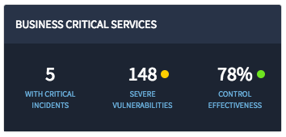

# Status Card

## Description
This widget can be used to quickly craft a status card with configurable options.

## Screenshots



## Additional Information/Notes
> None

## Installation
Download and install update set **[pe-status-card.u-update-set.xml](https://github.com/platform-experience/serviceportal-widget-library/blob/master/pe-status-card/pe-status-card.u-update-set.xml)** <br/><br/>
After installation, the widget can be accessed via the `Service Portal > Widgets` section for use and customization.<br/>
* SN Product Documentation - ['Load a customization from a single XML file'](https://docs.servicenow.com/bundle/jakarta-application-development/page/build/system-update-sets/task/t_SaveAnUpdateSetAsAnXMLFile.html)

## Configuration

### Widget Option Schema
| Option | Description | Default Value |
| :--- | :--- | :--- |
| `Title` | Used for changing the title in the panel header. | Business Critical Services |
| `Status Number 1` | Displays the first status integer in the panel body. | 5 |
| `Status Number 2` | Displays the second status integer in the panel body. | 148 |
| `Status Number 3` | Displays the third status integer in the panel body. | 78 |
| `Sub Text 1` | Displays the first sub-text copy. | With Critical Incidents |
| `Sub Text 2` | Displays the second sub-text copy. | Severe Vulnerabilities |
| `Sub Text 3` | Displays the third sub-text copy. | Control Effectiveness |
| `Status Indicator 2` | Provides a choice of status indicators. | warning |
| `Status Indicator 3` | Provides a choice of status indicators. | normal |

### Status Indicator Choices
* danger
* normal
* warning

## Platform Dependencies
> None

## Sample Data and Data Structures
> See 'Configuration' above

## API Dependencies
<i>Dependencies are included and configured as part of the provided Update Set.</i>
> None

## CSS/SASS Variables
_CSS/SASS variables are given default values that can be overridden with theming or portal-level CSS._

```scss
$pe-status-color-danger: #ff0050 !default;
$pe-status-color-normal: #6ee520 !default;
$pe-status-color-warning: #ffce00 !default;
$pe-anchor-color: #68acd8 !default;
```